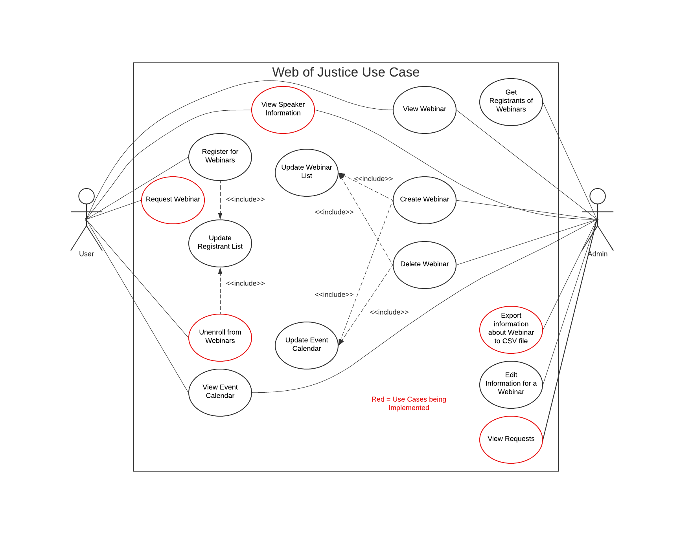

# Welcome to _PayPal Payment Mechanism_ of the _Rails of Justice Project_

### Video Tutorials for Installation
* [CSC 415: Virtual Machine Setup Tutorial - Video 1](https://youtu.be/IMb4cCGBQFA)
* [CSC 415: SSH Key Setup - Video 2](https://youtu.be/fbyiFgUZDMs)
* [CSC 415: SSH and vscode setup - Video 3](https://youtu.be/BTOIt7wjJxA)
* [CSC 415: GitHub and vscode - Video 4](https://youtu.be/-1C81UCUtIM)

### Guidelines for Maintaining and Improving PayPal Payment Mechanism
* [Guidelines for Maintaining and Improving PayPal Payment Mechanism for Future Volunteers and Students](https://github.com/TCNJ-SE/RoJ-Spr23/blob/collab12-prototype1/docs/Guidelines%20for%20future%20volunteers.md)

### Note for Users and Developers
* [Email Functionality Solution Needed](https://github.com/TCNJ-SE/RoJ-Spr23/blob/main/docs/message_about_email.md)

### UML Diagrams of current ROJ implementation

* [Class Diagram](https://github.com/TCNJ-SE/RoJ-Spr23/blob/main/docs/uml-diagrams/Rails%20of%20Justice%20-%20Class%20Diagram.png)
* [Use Case Diagram](https://github.com/TCNJ-SE/RoJ-Spr23/blob/main/docs/uml-diagrams/Rails%20of%20Justice%20-%20Use%20Case%20Diagram.png)

# Welcome to ADAS group and our project Web(inar)s of Justice
Description
The webinar page on the Rails of Justice website is still incomplete as there are several functions that still need to be polished, such as the page that displays the list of registrants. Additionally, it may be useful to ACCR to have additional functionality on the webinar page and polish the UI. Individuals registering for the webinar would also benefit from additional functionality. 

Objective
The objective would be to make bug free Webinar and Event Calendar modules. This would include fixing everything that is broken about the modules and ensuring additional extensions are bug free. Some of the functions that we have identified as potentially in need of fixing are:
 The page which displays the list of registrants for a webinar includes blank lines and missing information which make it look broken.
In the Event Calendar, when you select the “New Event” dropdown, you get the New Webinar page. However, not every event will necessarily be a webinar. 
Adding an Event from the “Add Event” dropdown does not save any information nor store it onto the calendar.
Changing UI to match the rest of the website?
It’s likely additional issues will arise while we start to work on the website.

We have a few ideas for extensions. First we would change the navbar to read just "Webinars". Then we can move the "Webinar Registration" page under there, and here this will show the upcoming and past webinars. For the list of webinars we can have the speakers listed with a hyperlink that brings some sort of page to show speaker contact information and a little blurb about them. 

Another addition would be to have an "About" tab under the Webinar navbar. Here we could have a form that could submit a request for a specific webinar that would email ACCR with the request. With admin privilege, we attempt to have an export option where webinars can be selected and information such as the registrants, speakers, etc., could be made into a CSV file. Another feature would allow users to deregister from a webinar they registered for using their name and email. 

These features are innovative and new because the team creatively thought of them. They will benefit both admin and non-admin users. Similar systems may exist for different organizations. For example, Canvas has an option to attend Zoom meetings within the website. However, our additions would be specifically catered to the ACCR organization. 

### [Installation/Usage](docs/Team21/Installation.md)
### [Guidelines](docs/Team21/Guidelines.md)

### [Test Case Design](docs/Team21/TestCaseDesign.docx)

### [Team Code](docs/Team21/Team_21-Team_Code.md)

### [Requirements and Analysis Information + Detailed Use Cases](docs/Team21/Elaboraton:RequirementsModelingandAnalysis.md)

### Use Case

### [Other Diagrams](docs/Team21/DesignDocuments.md)

* [Class Diagram](https://github.com/TCNJ-SE/RoJ-Spr23/blob/main/docs/class-diagram.md)
* [Use Case Diagram](https://github.com/TCNJ-SE/RoJ-Spr23/blob/main/docs/use-case.md)

