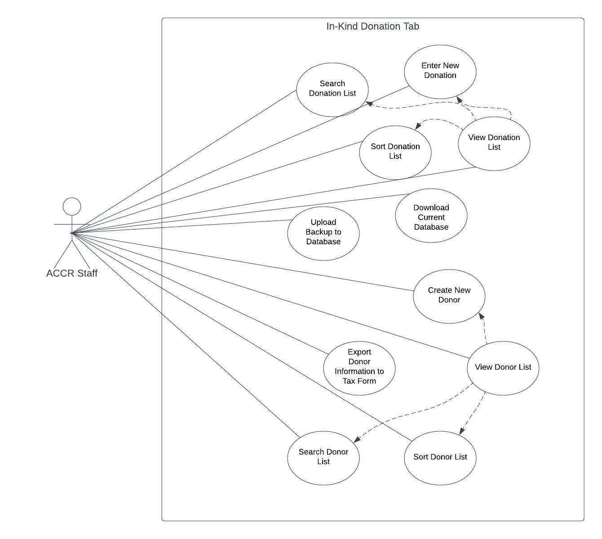

# Welcome to the _Rails of Justice Project_

### Developed by TCNJ Software Engineering Sections for the _Atlantic Center for Capital Representation_

### Updated Changes in Iteration 5 (Prototype 3 - 4/23/23)
 * Our team in this iteration was able to implement filtering capabilities in addition to sorting pro-bono entries in this prototype.
 * The controller handling pro-bono entries has been revised extensively to reflect these changes. PSQL queries were made accordingly to ensure that no SQL injection will occur. 
 * UI has been refined in the Pro-bono table view to reflect the new module for filtering attributes. UI regarding required fields (red asteriks) as been aligned properly (asterik goes next to the label name)
 * Statistics Page has been fixed to properly add up total number of pro-bono hour work & monatary value from the table, however a future implmentation still needs to be addressed to calculate values for individual admins.

### Updated Changes in Iteration 4 (Prototype 2 - 3/29/23)
 * Our team in this iteration was able to successfully implmement the sorting feature under the pro-bono hours table. 
 * Given the following attributes- Lawyername, Service Type, Case Name, Date, Hours, and Fees that represent each pro-bono case, when you click on the attribute heading on the table it will sort by increasing/decreasing order. 
 * GUI elements indicate which attribute is in which order. (Down arrow indicates decreasing order, up arrow indicates increasing, diamond shape indicates the attribute that is currently not selected for sorting)
 * In future iterations of the project, we have determined the where the logic behind the statistic calulations (functions) are located. We also need to start planning how filtering logic can be implemented in the next iteration.

### Updated Changes in Iteration 3 (Prototype 1 - 3/7/23)
 * Our team started looking into the Pro-Bono hours page to see which attributes can our filtering feature present. In this iteration, we added buttons/drop and dropdown menus that reflects the choices an admin might make as a "filtering query". Determining the hour and fee range options of each Pro-Bono case has been temporarily hardcoded, but we have contacted ACCR (as of 3/8/23) to get a sense of how long each case might take and the projection of fees.
 * We also started to make UI improvements on the Pro-Bono entries page to notify admins that certain fields are required. This has not been fully implemnted since last semester.
 * In future iterations of the project, we will need to find the logic behind these buttons, and how selected values can reflect to PostgreSQL commands.
 
 ### UML Diagrams (Updated in Iteration 5 - 4/23/23)
 * [Use Case Diagram](https://github.com/TCNJ-SE/RoJ-Spr23/blob/collab24-p2-team-code-branch/docs/se_cab24%20-%20usecase_markup.md)
 * [Proposed Use Case Descriptions](https://github.com/TCNJ-SE/RoJ-Spr23/blob/collab24-p2-team-code-branch/docs/uml-diagrams/SE_CAB24%20-%20Use%20Case%20Descriptions.pdf)
 * [UI Mockups](https://github.com/TCNJ-SE/RoJ-Spr23/blob/collab24-p2-team-code-branch/docs/se_cab24%20-%20UI_markup.md)
 * [UPDATED Design Class Diagram](https://github.com/TCNJ-SE/RoJ-Spr23/blob/f69ff5efe7fe49a3040271900b92fec702cd1fcc/docs/uml-diagrams/SE_CAB24%20-%20(Updated)%20Design%20Class%20Diagram.png)
 * [System Sequence Diagrams (SSDs)](https://github.com/TCNJ-SE/RoJ-Spr23/blob/collab24-p2-team-code-branch/docs/se_cab24%20-%20ssd_markup.md)
 * [State Diagram](https://github.com/TCNJ-SE/RoJ-Spr23/blob/collab24-p2-team-code-branch/docs/se_cab24%20-%20statediagram_markup.md)

### Detailed Guidelines
* [Guidelines and Future Collaborative Goals](https://github.com/TCNJ-SE/RoJ-Spr23/blob/f69ff5efe7fe49a3040271900b92fec702cd1fcc/docs/Guidelines.md)

### Instructions
* [Installation and Usage Instructions ](https://github.com/TCNJ-SE/RoJ-Spr23/blob/f69ff5efe7fe49a3040271900b92fec702cd1fcc/docs/se_cab24%20-%20InstallationProBono.md)

### Team 24 - Team Code
* [Team Code](https://github.com/TCNJ-SE/RoJ-Spr23/blob/f69ff5efe7fe49a3040271900b92fec702cd1fcc/docs/Team%2024%20-%20Team%20Code.md)

## Team Project Name -> Improving the Pro-Bono Case Module (CAB Team 24)
### 1) Description of the problem to be solved
On the ACCR website, under the pro-bono work module, one of the problems that can be solved is improving user accessibility. In other words, the user interface can be improved to make it easier for the users. Currently, there are no asterisks placed next to mandatory questions and due to this, the admin will not be able to identify which questions are mandatory and which are not. Overall, a good UI can make it easy for users to navigate and interact with an application and can also help to increase the efficiency of completing tasks. A well-designed UI also makes it less likely that users will make errors leading to a better user experience.

Additionally, under the view/search hours, there is currently only a single search box to search for information from the entries and there is no capability to sort by training. Due to this, the central problem is a user can only search for information by a single attribute and since there is no sorting available, this can lead to a lack of analysis as one might not be able to identify patterns and relationships that can be required for data analysis. There is also a problem relating data entries on the number of hours each service type takes. The Pro-Bono module contains a statistics page where the total number of consulting, training, and representation hours are displayed. However, there is no calculation or formula for gathering this information. 

### 2) Description of the objective of the proposed project to address the problem.
The pro-bono module of the ACCR website lacks a lot of functionality that, if resolved, would make administrator access much more user-friendly. One of our main aims is to build on the existing framework and make requirements for valid entries clear for the staff. It is certain that when requirements are not clear, very often this can lead to a frustrating and unproductive work experience. Having said that, this process should be as streamlined as possible to facilitate the best user experience for enhanced work efficacy. In terms of functionality, we propose that adding a filter to the pro-bono search module would assist the user in properly locating strings tied to specific fields that would otherwise be cumbersome to access or navigate to. Our aim is to develop a user-friendly interface that allows users to easily access the required information. Hence, the main objectives of this proposed project will be to enhance user accessibility and provide a comprehensive analysis. In addition to the analysis of pro-bono data, we need a mechanism to calculate the total number of pro-bono hours in each category.

### 3) Description of how the project will meet this objective.
The main problem that will be solved in this project is with the “Pro-Bono Work” module. Our work will focus on improving user accessibility and providing a better analysis of the Pro-Bono work. 

One of the problems that we will be working on is when a user is creating a pro-bono entry, they do not know which fields are required. The page says “Fields marked with * are required” but since there are no * present next to any input box, the user will not be aware of the fields that are required and the fields that are not. Additionally, only when the user clicks on the submit button, they will know if they have left any input box that is required as blank. Therefore, to make it easier for the users, if an * box is left empty, then on the screen before clicking on the submit button, we plan on giving an error message ahead of time. This solution can help with improving user accessibility. 

Under the Pro-Bono Hours, there is a search box present. So if a user wants to get all the information related to a staff name, service type, case name, etc then the user can type in the search box. However, for better analysis, we will be working on adding filters that can help with sorting the data. For instance, with the page that is currently present, the user can only get information based on one attribute but we are planning to add filters that can help the user to filter data based on multiple attributes. This way, through these filters, the user will be able to extract information for situations like service type as training, fees below 20, etc and this can result in making better analysis.

### 4) Explanation of what aspect of the project is innovative, and why.
In our project, we plan on allowing the admin to filter the results by different attributes. For instance, if the admin wants to get all the data in the entries with hours < 20, then this can be done through the filters that we will be making. We will work on creating many filters based on hours, dates, lawyers, and more based on necessities and limitations. This solution is innovative as it can help the ACCR staff in so many ways. Filtering on multiple columns is important in large datasets because it allows for more specific and targeted data analysis. In other words, it is innovative as it can help the staff narrow down the entire data to only a specific subset of information which can make it easier to identify patterns, trends, and insights. 

### 8) Updated Use Case Diagram for Advanced Filtering/Sorting on Pro-Bono Entries:

### This application contains six main modules. You can find more information on each linked below.
* [Pro Bono Tracker](https://github.com/TCNJ-SE/RoJ-Spr23/blob/main/docs/readme_files/probono_readme.md) module
* [Mapping Justice](docs/readme_files/mapping_justice_readme.md) module
* [Mail Manager](docs/readme_files//mail_manager_readme.md) module
* [In-Kind Donations](https://github.com/TCNJ-SE/RoJ-Spr23/blob/main/docs/readme_files/inkind_readme.md) module
* [Webinar Registration](https://github.com/TCNJ-SE/RoJ-Spr23/blob/main/docs/readme_files/Webinar_Registration_readme.md) module
* [Event Calendar](https://github.com/TCNJ-SE/RoJ-Spr23/blob/main/docs/readme_files/calendar_readme.md) module

### Installation Guide
* [Installation Instructions](https://github.com/TCNJ-SE/RoJ-Spr23/blob/main/docs/Installation_Guide.md)

### Video Tutorials for Installation
* [CSC 415: Virtual Machine Setup Tutorial - Video 1](https://youtu.be/IMb4cCGBQFA)
* [CSC 415: SSH Key Setup - Video 2](https://youtu.be/fbyiFgUZDMs)
* [CSC 415: SSH and vscode setup - Video 3](https://youtu.be/BTOIt7wjJxA)
* [CSC 415: GitHub and vscode - Video 4](https://youtu.be/-1C81UCUtIM)

### Note for Users and Developers
* [Email Functionality Solution Needed](https://github.com/TCNJ-SE/RoJ-Spr23/blob/main/docs/message_about_email.md)

### UML Diagrams of current ROJ implementation

* [Class Diagram](https://github.com/TCNJ-SE/RoJ-Spr23/blob/main/docs/uml-diagrams/Rails%20of%20Justice%20-%20Class%20Diagram.png)
* [Use Case Diagram](https://github.com/TCNJ-SE/RoJ-Spr23/blob/main/docs/uml-diagrams/Rails%20of%20Justice%20-%20Use%20Case%20Diagram.png)

Collab 23 
Enhancement Proposal for Mapping Justice

1. Description of the problem to be solved.
    
    When looking at various modules and tabs within Rails of Justice, one of the main features our team wanted to tackle and add upon was the Mapping Justice. When looking at the website right now, the only way for a user to input data is by downloading, editing, then reuploading the csv file of the database. Since the data is static, the only way of editing the information within the map was by editing the code of the website or reuploading a CSV file to change values. We also found some design problems within the page. For example, when hovering over a county, it is rather hard to read data. We also found it odd that the map is relatively small and not centered on the page, which we hope to adjust.

2. Description of the objective of the proposed project to address the problem.

    Mapping Justice serves as the sole visual and interactive media representation of the ACCR’s mission throughout the website. For first time viewers it can be a little confusing, the heat map of the counties currently combines current ongoing cases and incarcerated people on death row into one category with the other viewing category being population. The heat gradient only contains three levels which makes it difficult to understand which categories certain counties fall under, especially when the discrepancies between members can range from 2 current cases with 4 individuals on death row to 0 current cases with 28 individuals on death row. 
    It is our desire to restructure the viewing experience to make it easier to process by introducing more visual distinctions to the information provided within the map and look toward making it more colorblind friendly. Additionally we want to create a UI that will provide ACCR staff the ability to update the map and individual counties simpler and faster than the current CSV file upload infrastructure.

3. Description of how the project will meet this objective. 
    
    To enter data for the Mapping Justice, first creating a new page. This page will only be accessible by admin level users, so the public can’t see it. Since either is a limited number of counties, a drop down menu would be best. When selecting a county, the page will populate the input entries with the old data. ACCR staff will be able to then edit the data from Rails of Justice. This data will then replace the old data stored in the database. Another input form of a csv file will also be available so that large data changes can be made.
    To enhance the Mapping Justice, we want to make changes to improve the user experience. Currently when hovering over a county to see the information, it is hard to read. There should be a background to the text to make it clear. Over to have the information appear next to the map. Other problems are the clarity of the map. Allowing for more colors/gradients will increase the readability of the map. Especially separating the 0 case/dr from the 1 case/dr counties. Other changes like increasing county lines and centering the map will increase user experience. New map modes could also be added to separate the cases and Death Row to their own maps.

4. Explanation of what aspect of the project is innovative, and why.
    Creating a dropdown menu as well as introducing a way to provide data for the map is innovative because it will accommodate for changing data without having to go into the code. It improves the ease of maintenance for the website as well as the ACCR staff users because they need to be able to constantly update the information quickly and easily. Enabling staff to update specific counties one at a time will be beneficial as one county may need to be updated but others may not. 

8. A simple use case diagram showing the project functionality. Identify the functionality that will be implemented in each prototype and completed within the time constraints of the semester. Specify functionality that is beyond the semester scope but could be added in future versions.
    
    Throughout the course of the semester, we want to first replace the “Add to Database” functionality to a more user-friendly interface that allows a user to input data, allowing the database to update itself. From there, we want to update the proposed plans for the map, then create the last finishing touches, making the map visually appealing, and fixing any bugs that may have occurred.    

* Prototype 1 (3/9): Change the upload tab to add/edit entry, add counties and ability to click edit within the table of the add/edit entry page, change colors of map and provide background for information provided by the county
* Prototype 2 (3/30): Allow user to input data and make changes to the map UI to be more clear and visually appealing
* Prototype 3 (4/24): Allow user's data input to be reflected on the database, create searching cababilities within the edit page, create finishing touches, and fix any bugs that may have occurred.

### [Team Code](https://github.com/TCNJ-SE/RoJ-Spr23/blob/collab23-prototype1/docs/Team23/TeamCode.md)
### Diagrams & Information
* [Use Case](https://github.com/TCNJ-SE/RoJ-Spr23/blob/collab23-prototype1/docs/Team23/CAB%2023%20-%20Use%20Case.png)
* [Requirements and Analysis Information](https://github.com/TCNJ-SE/RoJ-Spr23/blob/collab23-prototype1/docs/Team23/RequirementsModelingAnalysis)
* [Detailed Use Case](https://github.com/TCNJ-SE/RoJ-Spr23/blob/collab23-prototype1/docs/Team23/Use_Case_Descriptions.md)
* [Design Class Diagram](https://github.com/TCNJ-SE/RoJ-Spr23/blob/collab23-p2-map/docs/Team23/DesignClassDiagram.png)
* [Map System Sequence Diagram](https://github.com/TCNJ-SE/RoJ-Spr23/blob/collab23-p2-map/docs/Team23/SSD_Map.png)
* [Edit Entry System Sequence Diagram](https://github.com/TCNJ-SE/RoJ-Spr23/blob/collab23-p2-map/docs/Team23/SSD_EditEntry.png)
* [Statechart](https://github.com/TCNJ-SE/RoJ-Spr23/blob/collab23-p2-map/docs/Team23/StateChart.png)
* [Installation and Usage Instructions](https://github.com/TCNJ-SE/RoJ-Spr23/blob/collab23-prototype3/docs/Team23/installation.md)
* [Guidelines](https://github.com/TCNJ-SE/RoJ-Spr23/blob/collab23-prototype3/docs/Team23/Guidelines.md)

### In-Kind Donations

The Atlantic Center for Capital Representation (ACCR) is a non profit
organization working towards the initiative of eliminating capital
punishment and defending those who face it. ACCR receives their
funding explicitly from donations. These donations can either be
monetary, direct funds being allocated for the organization to use, or
services for ACCR to use. The purpose of this project is to enhance
the In-Kind Donations functionality so it adequately supports the work
being done. In-Kind Donations are the primary method of donations the
organization typically receives, therefore having an efficient
functionality which organizes and keeps track of all data will allow
ACCR Staff to focus on their initiatives stronger.

ACCR works to assist in the defense of capital dependents. Rails of
Justice is an application that ACCR Staff can use in their mission to
increase equality in the criminal justice system. This sort of work
puts the appropriate amount of pressure on the criminal justice system
to justify all actions as to attempt to ensure complete fairness in
the system.

The problem to be solved is that from an admin user perspective the
usage of the in-kind donations tab is not fleshed out or streamlined.
Essentially, ACCR’s current way of tracking in-kind donations is not
efficient, and must be improved as this is an integral part of their
organization.

The objective of the project is to increase the functionality of the
"In-Kind Donations" tab on the Rails of Justice application to make
inputting data easier, faster, and clearer. The GUI should be
intuitive. The user should be able to analyze donation and donor data
in multiple and overlapping ways to allow for useful insights. The
system should be secure — access should be controlled based on the
users’ level of permissions.

The project will improve the functionality of the In-Kind donation
system by making the data collection more comprehensive, connecting
the donor data to the donation list data, and using better algorithms
to sort and search through the data. We will be ensuring that the GUI
will be intuitive by following the 8 golden rules of design,
consulting with ACCR for user testing purposes as well as conducting
our own expert reviews. In order to complete the system’s security, we
will have multiple levels of access with different levels of
permission, ensuring that no user has more access to the system than
they need.

Based on feedback from ACCR, we intend to improve the user interface
to be better tailored to their needs.

Specifically, the forms for logging new donations and donors will be
functional and allow for proper data entry such that the ACCR staff
can log new donations and view donation history. The project will then
build upon existing code in order to fine tune the formatting and
functionality when adding new donations and donors, as well as when
downloading the .csv files into a text document and or excel
spreadsheet. Also, the project will implement searching and sorting
functionality so that past donations can be easily found.
Automatically creating donors when a donation is submitted, adding
contact information to the donation form to save ACCR staff from
submitting another form. The project will add to the “New Donation”
form by having it include contact information for the donor, which
will then automatically create a new donor in the donor database,
removing the need for a second form. When viewing a donor’s
information, all prior donations will be shown to identify what each
donor has given.

There are various commercial systems that are used to track monetary
donations, but there does not currently exist a commercial product to
track in-kind donations. This proposed project takes the existing,
partially implemented framework implemented for the "In-Kind
Donations" tab and improves upon it by making it functional and easier
for the ACCR staff.

The In-Kind Donations implementation involves the management and
access to confidential records regarding individuals’ financial data
and tax information. An ethical concern posed by this implementation
is the possibility of users unethically viewing data and not keeping
it confidential. For instance, it is a common practice for companies
to donate in kind as tax write offs and require documentation from
their donor receiver. Distribution of this data would cause an ethical
violation and legal concern.

ACCR and ACCR’s donors have a reasonable expectation of privacy; it’s
critical that our application respects that. Therefore, no one outside
of ACCR should be able to access any of the in-kind information
donation information. We will achieve this by restricting access to
the page to users who are signed in with the proper credentials.

Backup and recovery will be provided by allowing the user to download
the data of the database onto a file, and upload a file to populate
the database. As long as the user downloads the data often enough and
stores it eternally, data that has been corrupted can be restored by
uploading the most recent database copy back into the database.

[Folder containing all UML diagrams](docs/inkinds/uml-diagrams/)

Use-Case Diagram:

# Welcome to ADAS group and our project Web(inar)s of Justice
Description
The webinar page on the Rails of Justice website is still incomplete as there are several functions that still need to be polished, such as the page that displays the list of registrants. Additionally, it may be useful to ACCR to have additional functionality on the webinar page and polish the UI. Individuals registering for the webinar would also benefit from additional functionality. 

Objective
The objective would be to make bug free Webinar and Event Calendar modules. This would include fixing everything that is broken about the modules and ensuring additional extensions are bug free. Some of the functions that we have identified as potentially in need of fixing are:
 The page which displays the list of registrants for a webinar includes blank lines and missing information which make it look broken.
In the Event Calendar, when you select the “New Event” dropdown, you get the New Webinar page. However, not every event will necessarily be a webinar. 
Adding an Event from the “Add Event” dropdown does not save any information nor store it onto the calendar.
Changing UI to match the rest of the website?
It’s likely additional issues will arise while we start to work on the website.

We have a few ideas for extensions. First we would change the navbar to read just "Webinars". Then we can move the "Webinar Registration" page under there, and here this will show the upcoming and past webinars. For the list of webinars we can have the speakers listed with a hyperlink that brings some sort of page to show speaker contact information and a little blurb about them. 

Another addition would be to have an "About" tab under the Webinar navbar. Here we could have a form that could submit a request for a specific webinar that would email ACCR with the request. With admin privilege, we attempt to have an export option where webinars can be selected and information such as the registrants, speakers, etc., could be made into a CSV file. Another feature would allow users to deregister from a webinar they registered for using their name and email. 

These features are innovative and new because the team creatively thought of them. They will benefit both admin and non-admin users. Similar systems may exist for different organizations. For example, Canvas has an option to attend Zoom meetings within the website. However, our additions would be specifically catered to the ACCR organization. 

### [Installation/Usage](docs/Team21/Installation.md)
### [Guidelines](docs/Team21/Guidelines.md)

### [Test Case Design](docs/Team21/TestCaseDesign.docx)

### [Team Code](docs/Team21/Team_21-Team_Code.md)

### [Requirements and Analysis Information + Detailed Use Cases](docs/Team21/Elaboraton:RequirementsModelingandAnalysis.md)

### Use Case

### [Other Diagrams](docs/Team21/DesignDocuments.md)

* [Class Diagram](https://github.com/TCNJ-SE/RoJ-Spr23/blob/main/docs/class-diagram.md)
* [Use Case Diagram](https://github.com/TCNJ-SE/RoJ-Spr23/blob/main/docs/use-case.md)

